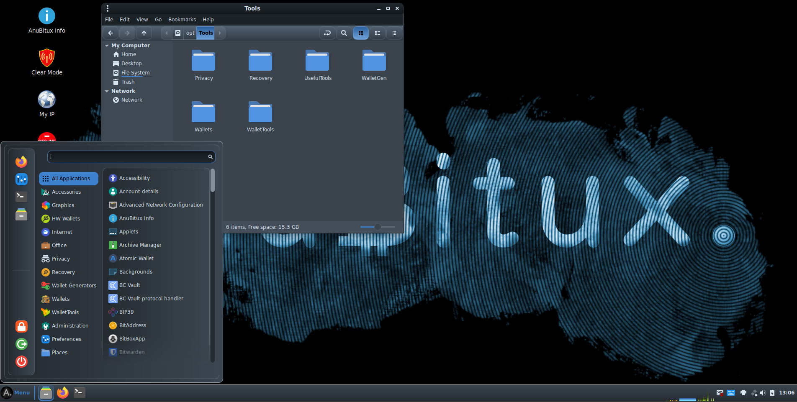

# Welcome to the AnuBitux documentation!

AnuBitux is a free and open source debian-based Linux distribution made to manage everything about your cryptos in a simple and safe way!

<figure><figcaption>
How the AnuBitux desktop looks like
</figcaption></figure>

It provides a full amnesic working environment with a lot of tools that can be used to:

* create new wallets (i.e. obtain paper wallets and/or mnemonic seeds from dice rolls, generate wallets through trusted software);
* print relevant information (like mnemonic seeds and private keys) without using an Internet connection;
* manage wallets, using hardware wallets (many devices supported), restoring them from mnemonic seeds or opening files that can be retrieved from an encrypted storage (like Veracrypt volumes or partitions, bitlocker partitions, keepass or bitwarden archives, etc.);
* recover access to wallets, scanning directories for relevant information, fixing missing parts of mnemonic seeds, or bruteforcing wallet files;
* surf the Internet anonymously thanks to Tor Browser, an heavily customized FireFox and the chance to proxy the whole system for only using the Tor network; &#x20;
* and even more!

It can be downloaded from the [official website](https://anubitux.org/download-anubitux/), also containing many tutorials, demonstrations, news and explanations.
