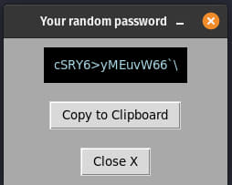

# Password generation

AnuBitux includes a cool [password generation tool](https://github.com/ASeriousMister/passgen.py). It can be started from the menu with the proper launcher or simply typing `password` in the terminal. It will provide a little pop up as the following.

<figure><figcaption></figcaption></figure>

Clicking on the `Copy to Clipboard` button it will automatically allow the user to paste the generated password. When clicking on the `Close X` button, the pop up window is closed and the clipboard is emptied. The generated password is not stored anywhere and cannot be recovered. The user is responsible for storing it in a proper way.
