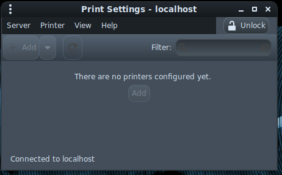

# Printing

Sometimes it may be very useful to print some kind of information that needs to be stored, like mnemonic seeds, QR codes, paper wallets, etc. AnuBitux tries to make it easy by supporting a lot of different printers without the need to connect to the Internet to retrieve drivers.&#x20;

In most of the cases it is enough to connect the printer to an USB port an turn it on and it should be automatically recognized. If it is not so, a lot of printers may be manually added through the Print Settings menu. Also if a printer gets recognized but does not work, it may be using the wrong drivers. This can also be solved through the Print Settings menu. &#x20;

<figure><figcaption></figcaption></figure>
