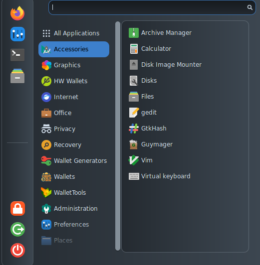

# Accessories

<figure><figcaption></figcaption></figure>

Beside the native Debian tools, AnuBitux provides:

* [GtkHash](https://gtkhash.org/), a graphical tool to calculate hash checksum values;
* [Guymager](https://guymager.sourceforge.io/), a tool to clone drives, useful for backup purposes;
* [Vim](https://www.vim.org/), an enhanced version of the vi text editor.
