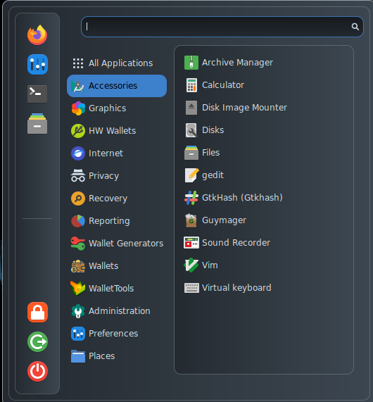

# Accessories

<figure><figcaption></figcaption></figure>

Besides the native Debian tools, AnuBitux provides:

* [GtkHash](https://gtkhash.org/), a graphical tool to calculate hash checksum values;
* [Guymager](https://guymager.sourceforge.io/), a tool to clone drives, useful for backup purposes;
* [Vim](https://www.vim.org/), an enhanced version of the vi text editor;
* Sound recorder can be used to check if microphone works properly;
* Virtual keyboard can be used with untrusted or unsupported hardware.
