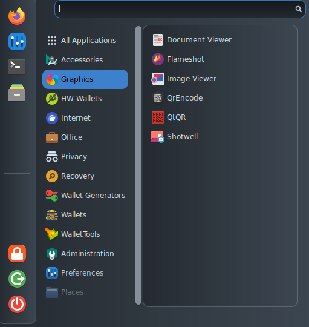

# Graphics

<figure><figcaption></figcaption></figure>

Beside the native Debian tools, AnuBitux provides:

* [Flameshot](https://flameshot.org/), a powerful screenshot software;
* [qrencode](https://packages.debian.org/source/buster/qrencode), a cli tool to create QR codes;
* [QtQR](https://packages.debian.org/bookworm/qtqr), a graphical tool to create, read and edit QR codes.
