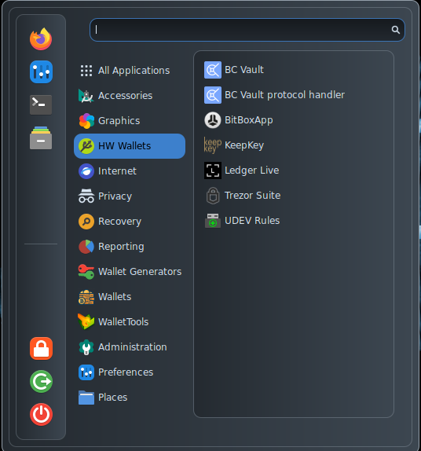

# HW Wallets

<figure><figcaption></figcaption></figure>

* [BC Vault](https://bc-vault.com/), the officiale client for BC Vault hardware wallets;
* [BitBoxApp](https://github.com/digitalbitbox/bitbox-wallet-app), the official client for [BitBox](https://shiftcrypto.ch/) hardware wallets;
* [KeepKey](https://www.keepkey.com/), the official client for KeepKey hardware wallets;
* [Ledger Live](https://www.ledger.com/ledger-live), the official client for [Ledger](https://www.ledger.com/) Hardware wallets;
* [Trezor Suite](https://suite.trezor.io/), the official client for [Trezor](https://trezor.io/) hardware wallets;
* [UDEV Rules](https://github.com/AnuBitux-project/scripts/blob/main/udev.sh), a custom script realized by the AnuBitux team to make AnuBitux able to interact with [hardware wallets](https://github.com/AnuBitux/udev) through the available clients. &#x20;
