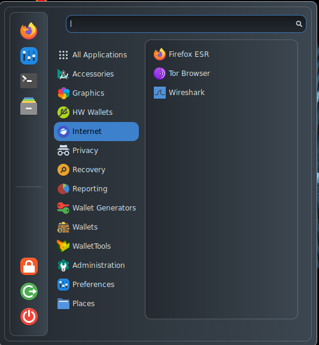

# Internet

<figure><figcaption></figcaption></figure>

* [Firefox](https://www.mozilla.org/en-US/firefox/new/) comes with an heavily customized profile focused on user's privacy and with a lot of crypto oriented addons, like:
  * [MetaMask](https://github.com/MetaMask/metamask-extension/) is a wallet for Ethereum accounts and a gateway to blockchain apps. It can be found as an extension of the FireFox browser;
  * [Temple](https://templewallet.com/) is a Tezos wallet that can be found as an extension of the FireFox browser;
  * [TonKeeper](https://addons.mozilla.org/en-US/firefox/addon/tonkeeper/?utm\_source=tonkeeper\_index) is a client wallet for the Ton network;
  * [Phantom](https://addons.mozilla.org/en-US/firefox/addon/phantom-app/?utm\_source=addons.mozilla.org\&utm\_medium=referral\&utm\_content=search) is a multi-chain web3 wallet;
  * [Enkript](https://addons.mozilla.org/en-US/firefox/addon/enkrypt/?utm\_source=addons.mozilla.org\&utm\_medium=referral\&utm\_content=search) is an extension for easy access to the world of web3 and to interact with Polkadot, Ethereum, Bitcoin and beyond - all directly in the browser;
  * [User-Agent Switcher](https://addons.mozilla.org/en-US/firefox/addon/user-agent-string-switcher/) allows to customize the browser's user agent;
  * [Privacy Badger](https://addons.mozilla.org/en-US/firefox/addon/privacy-badger17/) is an extension that blocks trackers;
  * [Canvas Blocker](https://addons.mozilla.org/en-US/firefox/addon/canvasblocker/) is an extension that alters some JS APIs to prevent fingerprinting;
  * [uBlock origin](https://addons.mozilla.org/en-US/firefox/addon/ublock-origin/) is a very powerful and well known ad-blocker;
* [Tor Browser](https://www.torproject.org/), the browser to surf the web through the Tor network;
* [Wireshark](https://www.wireshark.org/download.html), a very popular packet capturing tool, able to store and review all the data exchanged through the Internet.
