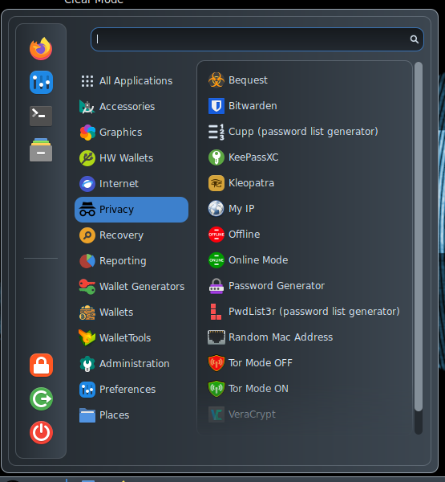

# Privacy

*

    <figure><figcaption></figcaption></figure>
* [Bequest](https://github.com/ASeriousMister/Bequest) is a custom tool that allows to encrypt messages hiding them in a series of QR codes;
* [BitWarden](https://bitwarden.com/) is a very popular, powerful and [open source](https://github.com/bitwarden) password manager;
* [Cupp](https://github.com/Mebus/cupp) is a well know password list generator that can be used in password guessing/recovery processes;
* [KeepassXC](https://keepassxc.org/) is an offline [open source](https://github.com/keepassxreboot/keepassxc) cross-platform password manager, that could also store any kind of information like mnemonic seed phrases;
* [Kleopatra](https://www.openpgp.org/software/kleopatra/) manages PGP Keys and allows to encrypt, decrypt, sign and verify text and files;
* My IP shows the current public IP address through [Kalitorify](https://github.com/brainfucksec/kalitorify)'s commands;
* [Offline](https://github.com/AnuBitux-project/scripts/blob/main/offline.sh) disables all the network interfaces, like Ethernet, WiFi and Bluetooth;
* [Online](https://github.com/AnuBitux-project/scripts/blob/main/online.sh) puts all network interfaces back to work;
* [Password Generator](https://github.com/ASeriousMister/passgen.py) creates true random passwords that can be copied and forgotten immediately;

<figure><figcaption></figcaption></figure>

* [PwdList3r](https://github.com/CYB3R-G0D/Pwdlist3r) is a well know password list generator that can be used in password guessing/recovery processes;
* [Random Mac Address](https://github.com/AnuBitux-project/scripts/blob/main/mac_random.sh) changes all the curernt mac addresses with random mac addresses;
* Tor Mode OFF disables [Kalitorify](https://github.com/brainfucksec/kalitorify) when enabled;
* Tor Mode ON enables [Kalotorify](https://github.com/brainfucksec/kalitorify) so that the whole working environment and all the tools connect through the Tor Network;
* [VeraCrypt](https://www.veracrypt.fr/en/Home.html) is a cross-platform [open source](https://github.com/veracrypt/VeraCrypt) tool that allows to encrypt and decrypt volumes and disks with many algorithms;
* [zuluCrypt](https://github.com/mhogomchungu/zuluCrypt) is a simple,feature rich and powerful solution for hard drives encryption. More info [here](https://mhogomchungu.github.io/zuluCrypt/).
