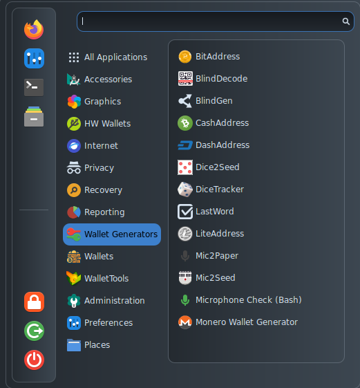

# WalletGenerators

<figure><figcaption></figcaption></figure>

* [BitAddress](https://github.com/pointbiz/bitaddress.org) is a javascript tool that runs locally and creates a Bitcoin paper wallet and that can be found at [bitaddress.org](https://www.bitaddress.org/);
* [BlindDecode](https://github.com/ASeriousMister/BlindGen) can be used to obtain private keys generated with BlindGen;
* [BlindGen](https://github.com/ASeriousMister/BlindGen) can be used to allow two users to obtain public addresses without having access to the whole private key;
* [CashAddress](https://github.com/theantnest/bccaddress) is a javascript tool that runs locally and creates a Bitcoin Cash paper wallet and that can be found at [cashaddress.org](https://cashaddress.org/);
* [DashAddress](https://github.com/dashpay/paper.dash.org) is a javascript tool that runs locally and creates a Dash paper wallet that can be found on [paper.dash.org](https://paper.dash.org/);
* [Dice2Seed](https://github.com/ASeriousMister/Dice2Seed) is a tool that obtaines a mnemonic seed starting from the entropy obtained rolling a dice;
* [DiceTracker](https://github.com/ASeriousMister/DiceTracker.py) is a tool that generates printable paper wallets starting from 256 dice rolls, removing the need to trust software's entropy;
* [LastWord](https://github.com/ASeriousMister/LastWord) is a tool that finds a last word that respects the BIP39 checksum for mnemonic phrases;
* [LiteAddress](http://liteaddress.org/) is a javascript tool that runs locally and creates a Bitcoin paper wallet and that can be found at [liteaddress.org](https://github.com/litecoin-project/liteaddress.org);
* [Mic2Paper](https://github.com/ASeriousMister/Mic2Paper) generates printable paper wallets obtaining entropy from the microphone;
* [Mic2Seed](https://github.com/ASeriousMister/Mic2Seed) generates BIP39 mnemonic seeds using entropy obtained from the microphone;
* [MicCheck](https://github.com/AnuBitux/MicCheck) can be used to check if the microphone works properly before generating paper wallets or mnemonic seeds;
* [MoneroWalletGenerator](https://github.com/moneromooo-monero/monero-wallet-generator/) is an offline Monero wallet generator that can also be found on [moneroaddress.org](https://moneroaddress.org/).
