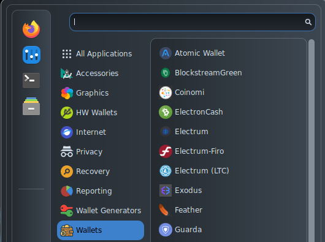
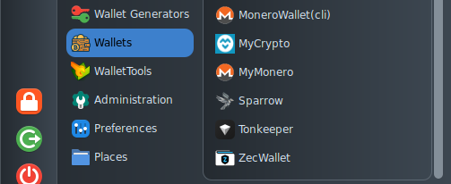

# Wallets

<figure><figcaption></figcaption></figure>

* [Atomic](https://atomicwallet.io/) is a widely used multi-coin wallet;
* [GreenWallet](https://blockstream.com/green/) is a desktop wallet, [developed](https://github.com/Blockstream/green\_qt/releases) by [Blockstream](https://blockstream.com/) that supports Bitcoin and even L-BTC on the [Liquid](https://blockstream.com/liquid/) sidechain.
* [Coinomi](https://www.coinomi.com/) is a widely used multi-coin wallet;
* [ElectronCash](https://electroncash.org/) is a version of the well known Electrum wallet that works with Bitcoin Cash;
* [Electrum(LTC)](https://electrum-ltc.org/) is a version of the well known Electrum wallet that works with Litecoin;
* [Electrum(BTC)](https://electrum.org/#home) is one of the most known and used SPV Bitcoin wallets;&#x20;
* [Electrum-Firo](https://github.com/firoorg/electrum-firo) is a version of the well known Electrum wallet that works with [Firo](https://firo.org/), an emergin privacy coin;
* [Exodus](https://www.exodus.com/) is a multi-currency and multi-service desktop wallet;
* [Feather](https://featherwallet.org/) is a very complete and powerful Monero wallet with a comfortable user interface that is similar to Electrum's one;
* [Guarda](https://guarda.com/desktop/) is a simple to use and powerful multi-coin wallet;

<figure><figcaption></figcaption></figure>

* [MoneroWallet(cli)](https://www.getmonero.org/downloads/#cli) is the command line version of the official Monero wallet;
* [MyCrypto](https://mycrypto.com/) is a wallet that allows to manage Ethereum accounts;
* [MyMonero](https://mymonero.com/) is a lightweight and efficient Monero wallet;
* [Sparrow](https://sparrowwallet.com/) is a Bitcoin wallet caring for user's privacy;
* [TonKeeper](https://tonkeeper.com/pro) is the official client for the Ton Network (it is already available as a browser extension);
* [ZecWallet](https://www.zecwallet.co/) is a fully featured shielded wallet for Zcash.
