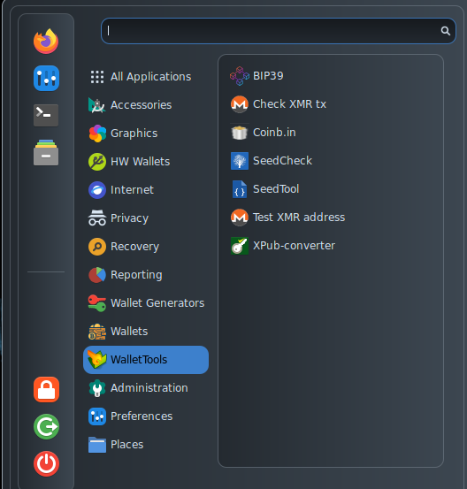

# WalletTools

<figure><figcaption></figcaption></figure>

* [BIP39](https://github.com/iancoleman/bip39) is the well known tool developed by Ian Coleman that handles derivation paths based on BIP39 wordlists. It is also available on his [website](https://iancoleman.io/bip39/);
* [Check XMR tx](https://github.com/luigi1111/xmr.llcoins.net/blob/master/site/checktx.html) is a tool that can be used to verify XMR transactions, providing the necessary keys;
* [Coinb.in](https://github.com/OutCast3k/coinbin/) is a tool that allows users to sign, verify and broadcast transactions that could also have been written from scratch. The tool is also available on the web at the [coinb.in](https://coinb.in/) page.
* [SeedCheck](https://github.com/ASeriousMister/SeedCheck.py) is a tool developed by the AnuBitux team that tries to find out the correct derivation path or the right software a mnemonic seed was used with;
* [SeedTool](https://bitcoiner.guide/seed/) is a powerful graphical Bitcoin-oriented tool to generate and handle BIP39 mnemonic seeds;
* [Test XMR address](https://github.com/luigi1111/xmr.llcoins.net/blob/master/site/addresstests.html) is a tool related to Cryptonote Addresses, used by the Monero protocol;
* [Xpub-converter](https://github.com/jlopp/xpub-converter) is a tool, by [Jameson Lopp](https://www.lopp.net/), that allows to convert among many different formats of xpub keys.&#x20;
