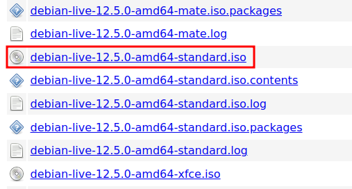

# How to create an AnuBitux VM

AnuBItux has been designed and developed to be used in an amnesic way, to leave no trace about user's activity on the devices but, in some cases, it may be necessary to use it in some testing or demo environment, like a virtual machine or a dedicated device.

If so, it is possible to "transform" an installed [Debian 12 Standard](https://cdimage.debian.org/debian-cd/current-live/amd64/iso-hybrid/) into a fully featured AnuBitux. It is suggested to install the Standard version with no desktop environment, setting an empty root password (in order to be able to run sudo commands with the normal user) and choosing the English language.

<figure><figcaption><p>The suggested Debian 12 version</p></figcaption></figure>

Once Debian 12 is installed, following the installation wizard and paying attention to respect the aforementioned suggestions, it is necessary to install git:

```
sudo apt -y install git
```

Then it is possible to clone the dedicated [GitHub repository](https://github.com/AnuBitux-project/AnuBituxVM):

```
git clone https://github.com/AnuBitux-project/AnuBituxVM
```

Now it is possible to move to the repository folder

```
cd AnuBituxVM
```

give execution rights to the script

```
chmod +x anubitux_vm.sh
```

and launch it

./anubitux\_vm.sh

It is necessary to provide the user's password in some occasion or press enter to add the additional repositories to the sourcces.list file, but no further action is required.

Once the script ends, it is only necessary to reboot the operating system

```
sudo reboot 0
```
