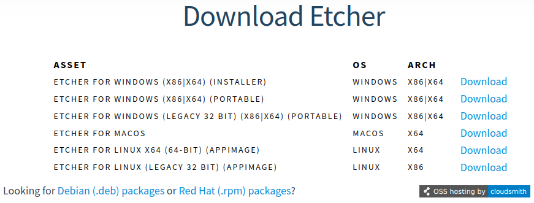

# Balena Etcher

[Balena Etcher](https://etcher.balena.io/) is a tool to flash USB drives with bootable .iso images that works on about all the operating systems. It can be downloaded from its official website in many different formats.

<figure><figcaption>
Available Balena Etcher installers
</figcaption></figure>

Once downloaded and installed, Balena Etcher has a very minimal interface.&#x20;

<figure><figcaption>
Balena Etcher's interface
</figcaption></figure>

It only requires the user to:

* select the .iso file to flash on the USB drive;
* select the USB drive on which to flash the .iso, remembering that the process will format it and all its previous content will be overwritten;
* click on the "Flash!" button and wait for the flashing process to finish.
