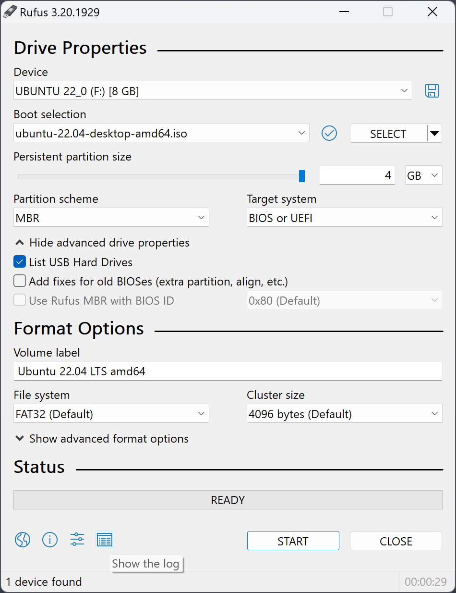

# Rufus

[Rufus](https://rufus.ie/) is a very lightweight tool to flash .iso files to USB drives only working on Windows operating systems.

<figure><figcaption>
The Rufus user interface
</figcaption></figure>

It only requires to:

* select the USB device on which to flash the .iso file;
* the .iso file to flash;
* click on the "START" button.

It is suggested to set the persistent partition size to 0, to keep the USB fully amnesic and avoid writing any information on it.&#x20;
