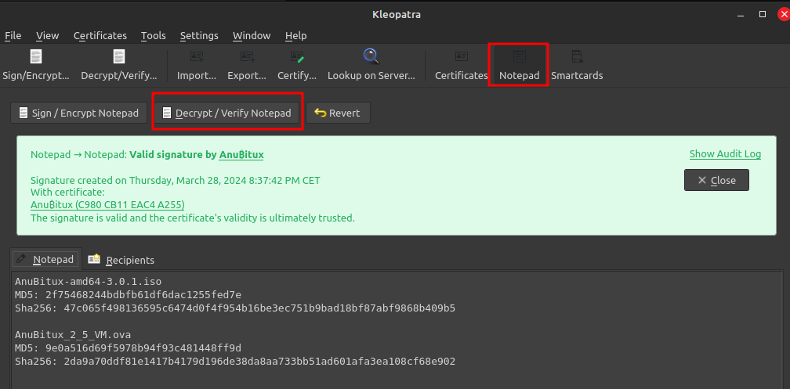

# How to verify AnuBitux

AnuBitux can be downloaded from many sources, like the official [Download page](https://anubitux.org/download-anubitux/) or even some alternative links managed through third party cloud providers.

Once the downloaded, it is possible to obtain hash checksum (MD5 and Sha256) of the .iso file and compare the values with the ones that are showed on the official website, even in the Download page.

To calculate the hash checksum values using Linux or MacOS, it is possible to use the CLI using the commands

```
md5sum AnuBitux-version-amd64.iso
sha256sum AnuBitux-version-amd64.iso
```

or even some GUI tool like [GtkHash](https://gtkhash.org/).

When using Windows, it is possible to obtain the hash checksum values using graphical tools like [HashMyFiles](https://www.nirsoft.net/utils/hash\_my\_files.html) or [QuickHash](https://www.quickhash-gui.org/). &#x20;

To be sure that the hash checksum values showed on the website are authentic, they are signed with the AunBitux official public PGP key, which can be retrieved from different sources, like [GitHub](../), [Pastebin](https://pastebin.com/bqmy9y2P) or [Keybase](https://keybase.io/anubitux).

To verify that the PGP signature on the AnuBitux website is valid, it can be checked through a graphical tool like [Kleopatra](https://apps.kde.org/kleopatra/).

Once Kleopatra is installed, it is necessary to import the AnuBitux public PGP key, which can be done even from the clipboard (copying the text of the PGP key and clicking on Tools -> Clipboard ->  Certificate Import.

Then it is necessary to mark the imported key as trusted, right clicking on it from the certificates list in Kleopatra and clicking on "Certify...".

Now, it is possible to verify the PGP signature by copying the whole PGP signed message form the AnuBitux website into Kleopatra's "Notepad" and clicking on the "Decrypt/Verify Notepad" button.

<figure><figcaption><p>Verifying a valid PGP signed message through Kleopatra</p></figcaption></figure>

If the hash checksum value obtained calculating it locally on the downloaded file matches the value showed on the AnuBitux website and the PGP signed message with the hash checksum values is valid (even checking the AnuBitux public PGP key from different sources), the downloaded AnuBitux iso file can be considered authentic.
