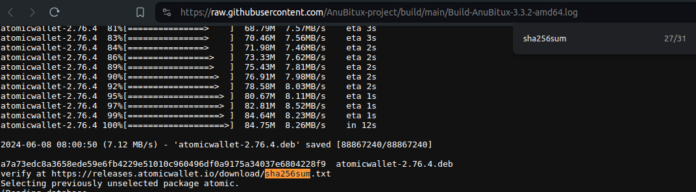
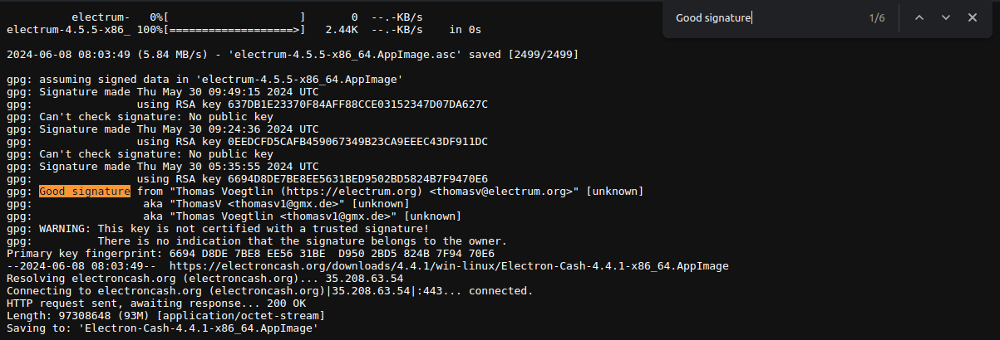
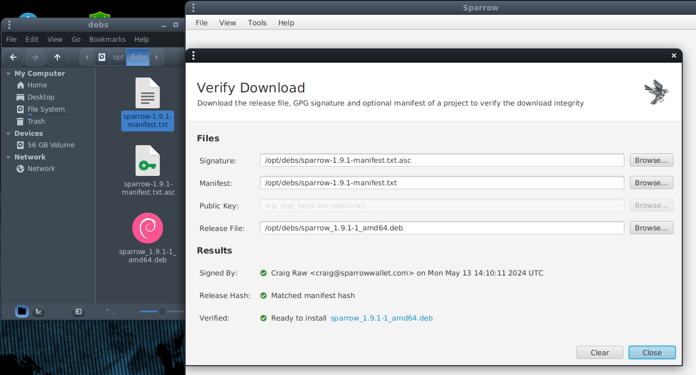

# How to verify the provided tools

After verifying the AnuBitux _.iso_ file, it is also possible to check how it was built, reading the logs provided on the [Download page](https://anubitux.org/download-anubitux/) or on the [GitHub repository](https://github.com/AnuBitux-project/build).

Lots of tools are obtained from the official Debian repositories.&#x20;

Other tools are retrieved from official websites or from their official GitHub repositories.

When the tools are downloaded, the sha256 checksum is included in the logs, so that it can be easily compared with the values provided on the tools' official websites. To find the values in the logs (which are more than 50k lines long) it is possible to open the text file, press `Ctrl+F` and search for the `sha256sum` string.

<figure><figcaption></figcaption></figure>

When available, also the signatures have been checked. To verify it, it is possible to search the logs for the `Good signature` string.

<figure><figcaption></figcaption></figure>

Sparrow has a dedicated verifying procedure. To check the installation it is necessary to drag\&drop  the installation _.deb_ file and the `sparrow-1.9.1-manifest.txt` file (which can be found in the /opt/debs folder with the signature of the manifest file and the _.deb_ file used for the installation) in the Sparrow GUI.

<figure><figcaption></figcaption></figure>

For some reason, the Sparrow Team decided to allow the [verification](https://sparrowwallet.com/download/#sparrow-183-or-later) of their tool after its installation and execution.

