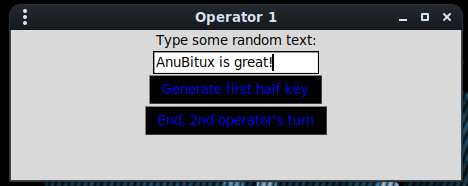
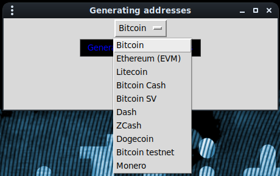
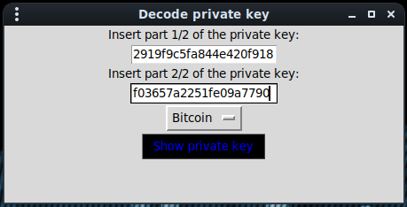

# Blind generation

AnuBitux also allows two operators to create a paper wallet without giving access to the whole private key to anyone. The procedure has been named Blind Protocl for crypto wallet generation.

This protocol has been designed for cases in which the operators are generating a wallet that has to receive coins for a third party or also for wallets that are going to be used to receive and keep funds that have to be shared between two owners. An example could be two forensic operators who are generating a wallet for a crypto currency seizure.

The main aim of this protocol is to provide a simple way to keep operators safe from every kind of future responsibility in case something would happen to the funds. A similar result could be obtained also with multi-signature wallets, but they may be difficult to use for non-expert operators.

To generate the wallet, it is enough to launch the BlindGen tool and follow the steps.

Users are prompted to insert some random text.

<figure><figcaption></figcaption></figure>

This is not the only source of entropy, since it would allow some threat actor to easily crack the wallet brute-forcing the tool with some common words lists.

Every time a piece of the private key is generated, the operator has to print it or to store it in a safe way. When every operator ends his turn, the pdf viewer is automatically closed and the file is permanently deleted and cannot be restored in any way, even providing the same words.

At the end, it is enough to choose the coin to obtain a printable public address with the related QR code.

<figure><figcaption></figcaption></figure>

To obtain the whole private key in wallet import format, it is necessary to use the BlindDecode tool. It asks for the two strings and the desired coin and then generates a printable pdf file with the desired WIF private key.

<figure><figcaption></figcaption></figure>

This step is supposed to be done only when it is necessary to spend the received funds.

On the AnuBitux there is a [tutorial](https://anubitux.org/blind-protocol-for-crypto-wallet-generation/) showing a step-by-step guide for this tool.
