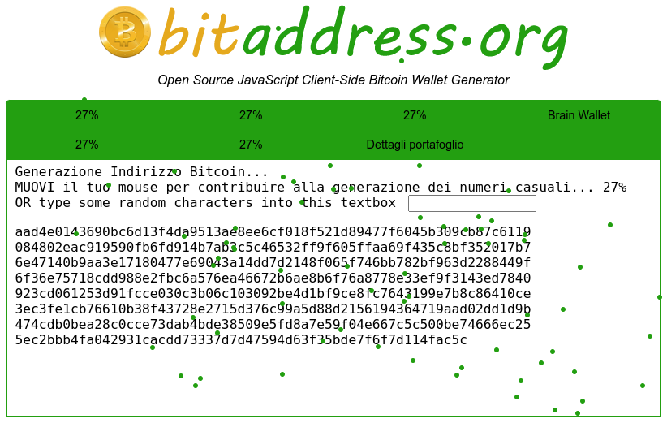
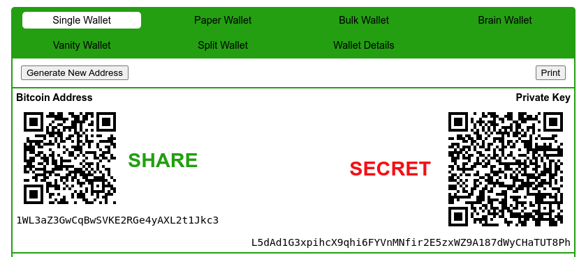

# From mouse movements

There are many tools, working through the Firefox browser, allowing the user to obtain printable paper wallets generating using the movements of the mouse as a source of entropy. Even if these tools are working in a web browser, they are written in javascript and are executed completely locally.

When these tools are started, they collect the movements of the mouse.

<figure><figcaption>
The entropy collecting phase
</figcaption></figure>

Then, when they have enough entropy, they provide a printable paper wallet.

<figure><figcaption>
The printable paper wallet, with keys and QR codes
</figcaption></figure>
